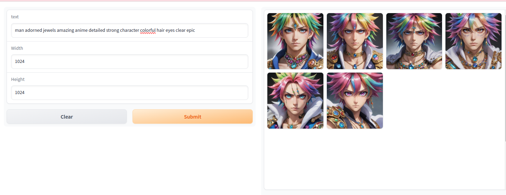

# Simple Stable Diffusion Server


Welcome to Simple Stable Diffusion Server, your go-to solution for AI-powered image generation and manipulation!

## Features

- **Local Deployment**: Run locally for style transfer, art generation and inpainting.
- **Production Mode**: Save images to cloud storage. By default files are uploaded
  to an R2 bucket via the S3 API, but Google Cloud Storage remains supported.
- **Versatile Applications**: Perfect for AI art generation, style transfer, and image inpainting. Bring any SDXL/diffusers model.
- **Easy to Use**: Simple interface for generating images in Gradio locally and easy to use FastAPI docs/server for advanced users.
- **Prompt Utilities**: Helper functions for trimming and cleaning prompts live in `stable_diffusion_server/prompt_utils.py`.

For a hosted AI Art Generation experience, check out our [AI Art Generator and Search Engine](https://aiart-generator.art), which offers advanced features like video creation and 2K upscaled images.

## Quick Start

### Setup

1. Create a virtual environment (optional):

    ```bash
    pip install uv
    uv venv
    source .venv/bin/activate
    ```

2. Install dependencies:

    ```bash
    uv pip install -r requirements.txt
    uv pip install -r dev-requirements.txt
    ```

3. Clone necessary models (or point to your own SDXL models in main.py)

    ```bash
    cd models
    git clone git@hf.co:/stabilityai/stable-diffusion-xl-base-1.0
    git clone git@hf.co:/dataautogpt3/ProteusV0.2

    # Optional for line based style transfer
    git clone git@hf.co:/diffusers/controlnet-canny-sdxl-1.0

    # ControlNet
    wget -O controlnet.safetensors https://huggingface.co/stabilityai/control-lora/resolve/main/control-LoRAs-rank256/control-lora-canny-rank256.safetensors
    ```

4. Install NLTK stopwords:

    ```bash
    python -c "import nltk; nltk.download('stopwords')"
    ```

### Running the Gradio UI

Launch the user-friendly Gradio interface:

```bash
python gradio_ui.py
```

Go to: http://127.0.0.1:7860

### Flux Schnell Example

The server now uses the lightweight Flux Schnell model by default. You can quickly
test the model with the helper script:

```bash
python flux_schnell.py
```

This will generate `flux-schnell.png` using bf16 precision.



## Server setup

### Edit settings

#### Configure storage credentials

By default the server uploads to an R2 bucket using S3 compatible credentials.
Set the following environment variables if you need to customise the backend:

```
STORAGE_PROVIDER=r2            # or 'gcs'
BUCKET_NAME=netwrckstatic.netwrck.com
BUCKET_PATH=static/uploads
R2_ENDPOINT_URL=https://<account>.r2.cloudflarestorage.com
PUBLIC_BASE_URL=netwrckstatic.netwrck.com
```

When using Google Cloud Storage you must also provide the service account
credentials as shown below.

To upload a file manually you can use the helper script:

```bash
python scripts/upload_file.py local.png uploads/example.png
```

#### Run the server

```bash
GOOGLE_APPLICATION_CREDENTIALS=secrets/google-credentials.json \
    gunicorn -k uvicorn.workers.UvicornWorker -b :8000 main:app --timeout 600 -w 1
```

with max 4 requests at a time
This will drop a lot of requests under load instead of taking on too much work and causing OOM Errors.

```bash
GOOGLE_APPLICATION_CREDENTIALS=secrets/google-credentials.json \
    PYTHONPATH=. uvicorn --port 8000 --timeout-keep-alive 600 --workers 1 --backlog 1 --limit-concurrency 4 main:app
```

#### Make a Request

http://localhost:8000/create_and_upload_image?prompt=good%20looking%20elf%20fantasy%20character&save_path=created/elf.webp

Response

```shell
{"path":"https://netwrckstatic.netwrck.com/static/uploads/created/elf.png"}
```

http://localhost:8000/swagger-docs


Check to see that "good Looking elf fantasy character" was created


### Testing

Run the unit tests with:

```bash
GOOGLE_APPLICATION_CREDENTIALS=secrets/google-credentials.json pytest tests/unit
```


#### Running under supervisord

edit ops/supervisor.conf

install the supervisor
apt-get install -y supervisor

```bash
sudo cat >/etc/supervisor/conf.d/python-app.conf << EOF
[program:sdif_http_server]
directory=/home/lee/code/sdif
command=/home/lee/code/sdif/.env/bin/uvicorn --port 8000 --timeout-keep-alive 12 --workers 1 --backlog 1 --limit-concurrency 2 main:app
autostart=true
autorestart=true
environment=VIRTUAL_ENV="/home/lee/code/sdif/.env/",PATH="/opt/app/sdif/.env/bin",HOME="/home/lee",GOOGLE_APPLICATION_CREDENTIALS="secrets/google-credentials.json",PYTHONPATH="/home/lee/code/sdif"
stdout_logfile=syslog
stderr_logfile=syslog
user=lee
EOF

sudo supervisorctl reread
sudo supervisorctl update
```

#### run a manager process to kill/restart if the server if it is hanging

Sometimes the server just stops working and needs a hard restart

This command will kill the server if it is hanging and restart it (must be running under supervisorctl)

```
python3 manager.py
```

# hack restarting without supervisor
run the server in a infinite loop

```
while true; do GOOGLE_APPLICATION_CREDENTIALS=secrets/google-credentials.json PYTHONPATH=. uvicorn --port 8000 --timeout-keep-alive 600 --workers 1 --backlog 1 --limit-concurrency 4 main:app; done
```

# windows setup

py -3.11 -m venv .wvenv
. .wvenv/Scripts/activate
python -m pip install uv
python -m uv pip install -r requirements.txt

# Deployment with GitHub Actions

This repository includes a workflow that builds Docker images for **RunPod**
and **Google Cloud Run**. Dependencies are installed with `uv pip` and the
workflow caches build layers for faster rebuilds. The workflow can be found in
`.github/workflows/docker-build.yml`. See [docs/deployment.md](docs/deployment.md)
for details on how to use the images.

# contributing guidelines
Please help in any way.


## Shameless Plug from Maintainers
[](https://netwrck.com)
[](https://aiart-generator.art)

Checkout [Voiced AI Characters to chat with](https://netwrck.com) at [netwrck.com](https://netwrck.com)

Characters are narrated and written by many GPT models trained on 1000s of fantasy novels and chats.

For Vision LLMs for making Text - Checkout [Text-Generator.io](https://text-generator.io) for a Open 
Source text generator that uses many AI models to generate the best along with image understanding and 
OCR networks.